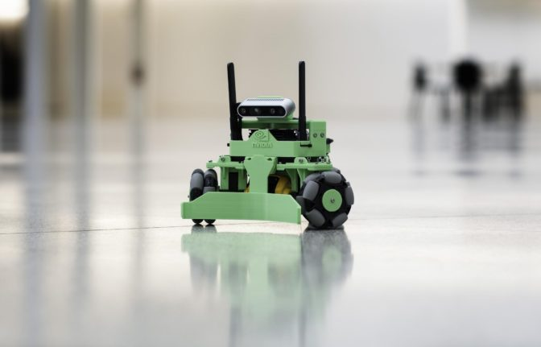

NVIDIA Kaya
======================

Kaya is a robot developed as a platform to demonstrate the power and flexibility of the Isaac Robot
Engine running on the NVIDIA Jetson Nano platform. It has been intentionally designed using 3D
printed parts and hobbyist components to be as accessible as possible.

`The Kaya Robot`

Kaya features a three-wheeled holonomic drive which allows it to move in any direction, regardless
of where it is facing. A RealSense depth camera allows Kaya to see the world around it in 3D,
enabling features like mapping, localization, object recognition. An on-board IMU and position
feedback from the wheel motors provide accurate odometry information. Power is provided via an
easily-swapped and fast-charging power tool battery. Outfitting the Jetson Nano with a
Wi-Fi/Bluetooth card allows for access to Isaac Sight over Wi-Fi, and connection of a gamepad
controller via Bluetooth.

Use the instructions in this section to build and operate your own Kaya. If you’re feeling
ambitious, it can also be customized to suit your own project.

Parts
----------------------

For a list of 3D printed parts, and STL files for creating the parts, see the
`Isaac Developer Downloads <https://developer.nvidia.com/isaac/downloads>`_ website.

The following is a list of the off-the-shelf components needed for building Kaya. Prices shown are
approximate and subject to change by vendors.

+-------------------------------------------------------------------------------+-------------------------------------------------------------------------------+-------------------------------------------------------------------------------+-------------------------------------------------------------------------------+-------------------------------------------------------------------------------+
| **PART NAME**                                                                 | **VENDOR PART #**                                                             | **SOURCE**                                                                    | **QTY**                                                                       | **APPROXIMATE** **COST**                                                      |
+===============================================================================+===============================================================================+===============================================================================+===============================================================================+===============================================================================+
| 3D Printed Parts                                                              | -                                                                             | *See 3D Printed Parts List*                                                   | -                                                                             | -                                                                             |
+-------------------------------------------------------------------------------+-------------------------------------------------------------------------------+-------------------------------------------------------------------------------+-------------------------------------------------------------------------------+-------------------------------------------------------------------------------+
| NVIDIA Jetson Nano Developer Kit                                              | 945-13450-0000-000                                                            | `NVIDIA <https://developer.nvidia.com/buy-jetson?product=jetson_nano>`__      | 1                                                                             | $99.00                                                                        |
+-------------------------------------------------------------------------------+-------------------------------------------------------------------------------+-------------------------------------------------------------------------------+-------------------------------------------------------------------------------+-------------------------------------------------------------------------------+
| MicroSD Card (32GB)                                                           | SDSQUNC-032G-GN6MA                                                            | `Amazon -                                                                     | 1                                                                             | $8.00                                                                         |
|                                                                               |                                                                               | SanDisk <https://www.amazon.com/SanDisk-microSDHC-Standard-Packaging-SDSQUNC- |                                                                               |                                                                               |
|                                                                               |                                                                               | 032G-GN6MA/dp/B010Q57T02/ref=sr_1_6?keywords=Micro+SD&qid=1550688765&s=gatewa |                                                                               |                                                                               |
|                                                                               |                                                                               | y&sr=8-6>`__                                                                  |                                                                               |                                                                               |
+-------------------------------------------------------------------------------+-------------------------------------------------------------------------------+-------------------------------------------------------------------------------+-------------------------------------------------------------------------------+-------------------------------------------------------------------------------+
| Intel Dual Band Wireless-Ac 8265 W/Bt                                         | 8265NGW                                                                       | `Amazon -                                                                     | 1                                                                             | $25.00                                                                        |
|                                                                               |                                                                               | Intel <https://www.amazon.com/Intel-Dual-Band-Wireless-Ac-8265/dp/B01MZA1AB2/ |                                                                               |                                                                               |
|                                                                               |                                                                               | ref=sr_1_1?keywords=intel+8265ngw&qid=1553724227&s=electronics&sr=1-1>`__     |                                                                               |                                                                               |
+-------------------------------------------------------------------------------+-------------------------------------------------------------------------------+-------------------------------------------------------------------------------+-------------------------------------------------------------------------------+-------------------------------------------------------------------------------+
| Dual Band Wi-Fi Antennas & IPEX4 to RP-SMA Cables                             | CHAOHANG 6484109                                                              | `Amazon <https://www.amazon.com/CHAOHANG-RP-SMA-Antenna-Soldering-Wireless/dp | 1                                                                             | $13.00                                                                        |
|                                                                               |                                                                               | /B01E29566W/ref=pd_bxgy_147_img_3/143-9820515-0065716?_encoding=UTF8&pd_rd_i= |                                                                               |                                                                               |
|                                                                               |                                                                               | B01E29566W&pd_rd_r=24e8099a-325b-11e9-9916-7fe6d01b346e&pd_rd_w=Hz2rK&pd_rd_w |                                                                               |                                                                               |
|                                                                               |                                                                               | g=eK9tl&pf_rd_p=6725dbd6-9917-451%22&%22d-beba-16af7874e407&pf_rd_r=0YDJ7K6AE |                                                                               |                                                                               |
|                                                                               |                                                                               | JE56W35GHQB&psc=1&refRID=0YDJ7K6AEJE56W35GHQB>`__                             |                                                                               |                                                                               |
+-------------------------------------------------------------------------------+-------------------------------------------------------------------------------+-------------------------------------------------------------------------------+-------------------------------------------------------------------------------+-------------------------------------------------------------------------------+
| Intel RealSense Depth Camera D435                                             | 961448                                                                        | `Intel <https://click.intel.com/intelr-realsensetm-depth-camera-d435.html>`__ | 1                                                                             | $179.00                                                                       |
+-------------------------------------------------------------------------------+-------------------------------------------------------------------------------+-------------------------------------------------------------------------------+-------------------------------------------------------------------------------+-------------------------------------------------------------------------------+
| Bosch GY-BMI160 6DOF IMU Board (Generic Breakout)                             | GY-BMI160                                                                     | `Amazon / eBay / AliExpress <https://www.amazon.com/s?k=GY-BMI160>`__         | 1                                                                             | $5.00                                                                         |
+-------------------------------------------------------------------------------+-------------------------------------------------------------------------------+-------------------------------------------------------------------------------+-------------------------------------------------------------------------------+-------------------------------------------------------------------------------+
| Dynamixel MX-12W Servo Motor                                                  | 902-0086-000                                                                  | `Robotis <http://www.robotis.us/dynamixel-mx-12w/>`__                         | 3                                                                             | $197.70                                                                       |
+-------------------------------------------------------------------------------+-------------------------------------------------------------------------------+-------------------------------------------------------------------------------+-------------------------------------------------------------------------------+-------------------------------------------------------------------------------+
| USB2AX v3.2a                                                                  | XE-USB2AX                                                                     | `Trossen Robotics <https://www.trossenrobotics.com/usb2ax>`__                 | 1                                                                             | $39.95                                                                        |
+-------------------------------------------------------------------------------+-------------------------------------------------------------------------------+-------------------------------------------------------------------------------+-------------------------------------------------------------------------------+-------------------------------------------------------------------------------+
| Dynamixel 6 Port AX/MX Power Hub                                              | IL-3PHUB                                                                      | `Trossen Robotics <https://www.trossenrobotics.com/6-port-ax-mx-power-hub>`__ | 1                                                                             | $7.95                                                                         |
+-------------------------------------------------------------------------------+-------------------------------------------------------------------------------+-------------------------------------------------------------------------------+-------------------------------------------------------------------------------+-------------------------------------------------------------------------------+
| VEX 3.25" Omni-Directional Wheel                                              | 217-4775                                                                      | `VEX Robotics <https://www.vexrobotics.com/omni-wheels.html>`__               | 3                                                                             | $53.97                                                                        |
+-------------------------------------------------------------------------------+-------------------------------------------------------------------------------+-------------------------------------------------------------------------------+-------------------------------------------------------------------------------+-------------------------------------------------------------------------------+
| DeWALT 20V MAX 2AH Li-ion Battery                                             | DCB203                                                                        | `Amazon -                                                                     | 1                                                                             | $45.00                                                                        |
|                                                                               |                                                                               | DeWALT <https://www.amazon.com/DEWALT-DCB203-Compact-Li-Ion-Battery/dp/B00BYK |                                                                               |                                                                               |
|                                                                               |                                                                               | VMES/ref=pd_day0_hl_469_4/143-9820515-0065716?_encoding=UTF8&pd_rd_i=B00BYKVM |                                                                               |                                                                               |
|                                                                               |                                                                               | ES&pd_rd_r=3f278334-46c0-11e9-969f-a1ee2b4b46aa&pd_rd_w=ntxfz&pd_rd_wg=BvWaf& |                                                                               |                                                                               |
|                                                                               |                                                                               | pf_rd_p=ad07871c-e646-4161-82c7-%22&%225ed0d4c85b07&pf_rd_r=B544K119P03BHEB88 |                                                                               |                                                                               |
|                                                                               |                                                                               | 5K0&psc=1&refRID=B544K119P03BHEB885K0>`__                                     |                                                                               |                                                                               |
+-------------------------------------------------------------------------------+-------------------------------------------------------------------------------+-------------------------------------------------------------------------------+-------------------------------------------------------------------------------+-------------------------------------------------------------------------------+
| DeWALT 20V MAX Li-ion Battery Charger                                         | DCB107                                                                        | `Amazon -                                                                     | 1                                                                             | $34.75                                                                        |
|                                                                               |                                                                               | DeWALT <https://www.amazon.com/dp/B06X94PH92/ref=psdc_8106529011_t1_B00X6BWHA |                                                                               |                                                                               |
|                                                                               |                                                                               | 6>`__                                                                         |                                                                               |                                                                               |
+-------------------------------------------------------------------------------+-------------------------------------------------------------------------------+-------------------------------------------------------------------------------+-------------------------------------------------------------------------------+-------------------------------------------------------------------------------+
| 5V 6A DC-DC Step-Down Regulator                                               | D24V60F5                                                                      | `Pololu <https://www.pololu.com/product/2865>`__                              | 1                                                                             | $19.95                                                                        |
+-------------------------------------------------------------------------------+-------------------------------------------------------------------------------+-------------------------------------------------------------------------------+-------------------------------------------------------------------------------+-------------------------------------------------------------------------------+
| 12V 5A DC-DC Step-Down Regulator                                              | EA60-12V                                                                      | `Amazon <https://www.amazon.com/gp/product/B01LY4RANA/ref=ppx_yo_dt_b_asin_ti | 1                                                                             | $9.50                                                                         |
|                                                                               |                                                                               | tle_o00_s00?ie=UTF8&psc=1>`__                                                 |                                                                               |                                                                               |
+-------------------------------------------------------------------------------+-------------------------------------------------------------------------------+-------------------------------------------------------------------------------+-------------------------------------------------------------------------------+-------------------------------------------------------------------------------+
| 2.1 x 5.5mm Male Barrel Plug Pigtail                                          | LYSB01GPL8MVG-CMPTRA                                                          | `Amazon <https://www.amazon.com/gp/product/B01GPL8MVG/ref=ox_sc_act_title_1?s | 1                                                                             | $0.80                                                                         |
|                                                                               |                                                                               | mid=A2QLFR4HNCTTLU&psc=1>`__                                                  |                                                                               |                                                                               |
+-------------------------------------------------------------------------------+-------------------------------------------------------------------------------+-------------------------------------------------------------------------------+-------------------------------------------------------------------------------+-------------------------------------------------------------------------------+
| Rocker Switch                                                                 | 7395K28                                                                       | `McMaster-Carr <https://www.mcmaster.com/7395k28>`__                          | 1                                                                             | $6.76                                                                         |
+-------------------------------------------------------------------------------+-------------------------------------------------------------------------------+-------------------------------------------------------------------------------+-------------------------------------------------------------------------------+-------------------------------------------------------------------------------+
| Terminal Block                                                                | 7527K44                                                                       | `McMaster-Carr <https://www.mcmaster.com/7527k44>`__                          | 1                                                                             | $2.24                                                                         |
+-------------------------------------------------------------------------------+-------------------------------------------------------------------------------+-------------------------------------------------------------------------------+-------------------------------------------------------------------------------+-------------------------------------------------------------------------------+
| Terminal Block Jumpers                                                        | 7527K59                                                                       | `McMaster-Carr <https://www.mcmaster.com/7527k59>`__                          | 2                                                                             | $0.49                                                                         |
+-------------------------------------------------------------------------------+-------------------------------------------------------------------------------+-------------------------------------------------------------------------------+-------------------------------------------------------------------------------+-------------------------------------------------------------------------------+
| Wire End/Terminal Kit                                                         | HC28-6                                                                        | `Amazon <https://www.amazon.com/Accessbuy-Insulated-Electrical-Connector-Conn | -                                                                             | $10.00                                                                        |
|                                                                               |                                                                               | ectors/dp/B01L3MSLO0/ref=sr_1_7?keywords=terminal+connector&qid=1549832593&s= |                                                                               |                                                                               |
|                                                                               |                                                                               | industrial&sr=1-7>`__                                                         |                                                                               |                                                                               |
+-------------------------------------------------------------------------------+-------------------------------------------------------------------------------+-------------------------------------------------------------------------------+-------------------------------------------------------------------------------+-------------------------------------------------------------------------------+
| 18AWG Electrical Wire (Red and Black)                                         | -                                                                             | `Amazon <https://www.amazon.com/Electrical-Gauge-Silicone-Cable-Black/dp/B074 | -                                                                             | $5.00                                                                         |
|                                                                               |                                                                               | 6HMTPP/ref=sr_1_6?keywords=18+awg+red+black+wire&qid=1553726358&s=industrial& |                                                                               |                                                                               |
|                                                                               |                                                                               | sr=1-6>`__                                                                    |                                                                               |                                                                               |
+-------------------------------------------------------------------------------+-------------------------------------------------------------------------------+-------------------------------------------------------------------------------+-------------------------------------------------------------------------------+-------------------------------------------------------------------------------+
| Female-Female Electrical Jumper Wires                                         | -                                                                             | `Amazon <https://www.amazon.com/GenBasic-Solderless-Dupont-Compatible-Breadbo | 4                                                                             | $5.00                                                                         |
|                                                                               |                                                                               | ard-Prototyping/dp/B077NH83CJ/ref=sr_1_3?crid=3AWMVM5JYO01Y&keywords=female%2 |                                                                               |                                                                               |
|                                                                               |                                                                               | Bfemale%2Bjumper%2Bwires&qid=1553793205&refinements=p_85%3A2470955011&rnid=24 |                                                                               |                                                                               |
|                                                                               |                                                                               | 70954011&rps=1&s=electronics&spre%22&%22fix=female%2Bfemale%2B%2Celectronics% |                                                                               |                                                                               |
|                                                                               |                                                                               | 2C178&sr=1-3&th=1>`__                                                         |                                                                               |                                                                               |
+-------------------------------------------------------------------------------+-------------------------------------------------------------------------------+-------------------------------------------------------------------------------+-------------------------------------------------------------------------------+-------------------------------------------------------------------------------+
| MakerBeam 150x10x10mm Beams                                                   | bamb150p06                                                                    | `Amazon -                                                                     | 3                                                                             | $5.00                                                                         |
|                                                                               |                                                                               | MakerBeam <https://www.amazon.com/MakerBeam-150x10x10mm-beam-black-anodised/d |                                                                               |                                                                               |
|                                                                               |                                                                               | p/B00G2DNT4I>`__                                                              |                                                                               |                                                                               |
+-------------------------------------------------------------------------------+-------------------------------------------------------------------------------+-------------------------------------------------------------------------------+-------------------------------------------------------------------------------+-------------------------------------------------------------------------------+
| MakerBeam 25 pieces T-slot nuts inc screws                                    | 101619                                                                        | `Amazon -                                                                     | 22                                                                            | $17.00                                                                        |
|                                                                               |                                                                               | MakerBeam <https://www.amazon.com/gp/product/B016OJNLJ2/ref=oh_aui_detailpage |                                                                               |                                                                               |
|                                                                               |                                                                               | _o01_s01?ie=UTF8&psc=1>`__                                                    |                                                                               |                                                                               |
+-------------------------------------------------------------------------------+-------------------------------------------------------------------------------+-------------------------------------------------------------------------------+-------------------------------------------------------------------------------+-------------------------------------------------------------------------------+
| M3 18mm threaded standoff                                                     | 95947A525                                                                     | `McMaster-Carr <https://www.mcmaster.com/95947a525>`__                        | 3                                                                             | $3.66                                                                         |
+-------------------------------------------------------------------------------+-------------------------------------------------------------------------------+-------------------------------------------------------------------------------+-------------------------------------------------------------------------------+-------------------------------------------------------------------------------+
| M3 x 35mm Socket Head Screw                                                   | 91292A033                                                                     | `McMaster-Carr <https://www.mcmaster.com/91292a033>`__                        | 7                                                                             | $3.54                                                                         |
+-------------------------------------------------------------------------------+-------------------------------------------------------------------------------+-------------------------------------------------------------------------------+-------------------------------------------------------------------------------+-------------------------------------------------------------------------------+
| M3 x 8mm Socket Head Screw                                                    | 91292A112                                                                     | `McMaster-Carr <https://www.mcmaster.com/91292a112>`__                        | 24                                                                            | $4.29                                                                         |
+-------------------------------------------------------------------------------+-------------------------------------------------------------------------------+-------------------------------------------------------------------------------+-------------------------------------------------------------------------------+-------------------------------------------------------------------------------+
| M3 x 5mm Socket Head Screw                                                    | 91292A110                                                                     | `McMaster-Carr <https://www.mcmaster.com/91292a110>`__                        | 20                                                                            | $4.72                                                                         |
+-------------------------------------------------------------------------------+-------------------------------------------------------------------------------+-------------------------------------------------------------------------------+-------------------------------------------------------------------------------+-------------------------------------------------------------------------------+
| M3 Hex Nuts                                                                   | 90591A250                                                                     | `McMaster-Carr <https://www.mcmaster.com/90591a250>`__                        | 20                                                                            | $2.21                                                                         |
+-------------------------------------------------------------------------------+-------------------------------------------------------------------------------+-------------------------------------------------------------------------------+-------------------------------------------------------------------------------+-------------------------------------------------------------------------------+
| M2 x 6mm Phillips Screw                                                       | 92010A003                                                                     | `McMaster-Carr <https://www.mcmaster.com/92010a003>`__                        | 14                                                                            | $4.39                                                                         |
+-------------------------------------------------------------------------------+-------------------------------------------------------------------------------+-------------------------------------------------------------------------------+-------------------------------------------------------------------------------+-------------------------------------------------------------------------------+
|                                                                               |                                                                               |                                                                               |                                                                               | **$812.87**                                                                   |
+-------------------------------------------------------------------------------+-------------------------------------------------------------------------------+-------------------------------------------------------------------------------+-------------------------------------------------------------------------------+-------------------------------------------------------------------------------+

Assembly Instructions
---------------------

This section describes step-by-step assembly of the Kaya robot.

**1 Assign IDs to Dynamixel motors**

When first purchased, the Dynamixel motors are all be assigned ID “1,” and must be assigned unique
IDs and properly configured before being connected together on Kaya. This procedure requires a USB
serial adapter (USB2AX or U2D2), an external 12V power source (the 12V DC-DC converter on Kaya), and
a PC which on which to run the RoboPlus v1 software. RoboPlus v2 does not work with MX-12W. See
`http://www.robotis.us/roboplus1/ <http://www.robotis.us/roboplus1/>`_ to download the RoboPlus v1
application.

You can also complete this step after the rest of Kaya is assembled. Just be aware that you should
only connect one motor at a time to avoid duplicate IDs.

To assign IDs to the motors:

1. Start the RoboPlus v1 application.

2. Connect the USB serial converter to the desktop.

3. Connect each Dynamixel motor to the serial adapter.

4. Power the Dynamixel motor externally (12V).

5. Launch Dynamixel Wizard in the RoboPlus v1 application.

6. Open Port (top menu) to detect connected motors.

7. Click on the correct motor, assign the ID # below and wheel mode. Click Apply.

    - Left: ID 1

    - Rear Wheel: ID 2

    - Right: ID 3

8. Repeat step 6 for each motor, and annotate the ID placard for each motor accordingly.

**2 Assemble Dynamixel hardware**

- Install an M2 nut that comes with the Dynamixel kit into the second nut hole up from the horn
  (servo head) on all sides. Press the nut firmly press into slots to secure.

  .. image:: images/kaya2.jpg

**3 Attach Dynamixel motors to motor bottom plates (3 per robot)**

- Attach each motor to motor bottom plates using 4 M2 screws that come with the motors. The motors
  can only be assembled one way in the chassis.

**4 Assemble wheel hubs (3 per robot)**

1. Insert an 18 mm M3 standoff into the hex hole of each inside wheel hub part.

2. Using the M2 hardware from the Dynamixel kit, find one hole for fastening each inside wheel Hub
   part.

   .. image:: images/kaya3.jpg

**4 Cut and crimp wires for battery terminals**

1. Cut 18 AWG wire to length: 80 mm of red, 140 mm of black. Use Male1 (red) from crimp set on one
   end of both cables, and crimp.

2. Crimp Female1 (red) to other end of BAT+ (red wire) for switch, and fork1 (red) to other end of
   BAT- (black wire.)

   .. image:: images/kaya4.jpg

**5 Connect battery terminals to the battery holder**

1. Place the terminal end into slots in the battery holder, paddles facing the middle. With the flat
   side down and the long end of the holder facing out, the B+ side is on the right. Push firmly on
   the top of the crimps to seat them properly in the channels.

2. Secure the battery terminal holder with self-tapping M3x8. Check alignment with a battery,
   checking through the window on the top of the carrier and using pliers to straighten out the
   paddles so they can align with B+ and B-.

   .. image:: images/kaya5.jpg

**6 Assemble the motor top plate/makerbeam frame**

1. Attach motor top plates to makerbeams using 4 makerbeam nuts and 4 M3x5 screws (per top plate).
   Install makerbeam nuts into channels first, 2 per side, and then align with the holes before
   fastening with screws.

2. After the first top plate, assemble the pusher mount on the sole beam attached. Assemble the
   triangle and tighten all 12 points. **Note the side with the pusher mount is the "Front" of the
   device now.** Repeat top plate assembly to form the triangle.

   .. image:: images/kaya6a.jpg

   .. image:: images/kaya6b.jpg

**7 Connect the bottom plate assembly to the motor top plate/makerbeam frame**

1. Position Bottom plate assemblies in the following configuration: ID 2 in the rear, ID 3
   to the right of the pusher, when looking from the top and the pusher is facing away.

2. insert M3 nuts into motor bottom plate nut holes, bolt down with m3x8. Tighten in all 12 places.

   .. image:: images/kaya7.jpg

**8 Wire the Dynamixel motors**

- Using the cables from the Dynamixel kits, wire the motors in the following order: 3 - 1 - 2 - OUT,
  or Right - Left - Rear - Extra cable from rear hanging.

  .. image:: images/kaya8.jpg

**9 Attach IMU mount to electronics bay**

- Solder the IMU mount pin header to the larger array of through holes, long ends on the pin label
  side. The IMU mount leads face towards the center of the electronics bay with 2 M2x6 screws, pin
  designators facing up.

  .. image:: images/kaya9.jpg

**10 Fasten power regulators to the electronics bay**

1. Solder the terminal blocks to the 5V regulator. Solder the auxiliary resistor if larger processor
   loads are required.

2. Fasten 5V and 12V regulators with m2x6 screws, and ensure Vin on the 5V regulator is on the same
   side as the 12V, as shown in the image.

   .. image:: images/kaya10.jpg

**11 IMU cables**

1. Attach header cables to IMU leads (SPECIFY WHICH) - Make note of the colors you are using for
   each pin.

2. Use a dab of hot glue on the middle side of the headers to hold to the IMU pin headers.

   .. image:: images/kaya11.jpg

See :ref:`wire-bmi160-imu` for more information.

**12 Assemble the antennas and fasten them to the Jetson Nano base**

1. Attach the coaxial ends of antenna cables to the antenna.

2. Turn the antennas 90 degrees and fit them in the designated channels on either side of the Jetson
   Nano base.

3. Affix with hot glue and/or zip ties as shown in the image.

   .. image:: images/kaya12.jpg

**13 Mount the Jetson Nano base to the frame assembly**

1. Orient the Jetson Nano Base so that motor ID#2 is in the rear, and the NVIDIA logo is on
   the side with the pusher mount.

2. Slide 1 makerbeam nut onto the top of the pusher makerbeam, and 2 makerbeam nuts onto the top of
   the other two beams.

3. Fasten the front screw (on the side with the NVIDIA logo) first, then position and fasten the
   other 4 screws to the side beam.

   .. image:: images/kaya13.jpg

**14 Connect the battery chassis assembly to new frame assembly**

1. Stack the battery holder and electronics bay together from the underside of the robot.

2. Ensure no cables are being pinched. Check that the cables from the front Dynamixel motor are not
   on top of the 12V supply. Use a M3x35 mm bolt through the Jetson Nano base and into the captured
   M3 nuts of the battery holder.

   .. image:: images/kaya14a.jpg

   .. image:: images/kaya14b.jpg

**15 Prepare the terminal block**

- Assemble 2 jumpers on one side on the terminal block for sharing B+ and B- with the two voltage
  regulators.

  .. image:: images/kaya15.jpg

**16 Cut and crimp wire**

1. Cut 6 120 mm cables, 3 red and 3 black.

2. Cut a 140 mm red cable for the switch lead.

3. Crimp forks to both ends of one set of red/black cables.

4. Strip the other 2 sets on one end and crimp on the other end.

5. The other 140 mm red cable has a female battery terminal (Female1, red) on end, and a fork on
   the other.

   .. image:: images/kaya16.jpg

**17 Wire and attach the power switch**

1. Pull the red BAT+ cable through, and locate the 140 mm cable with the female terminal created in
   the previous step.

2. Orient the power switch so the two leads are closer to the middle of the device, and attach the
   BAT+ female connector to one lead, and the other cable's female terminal to the other.

3. Bend both terminals slightly toward the outside of the robot, and insert the switch into the
   Jetson Nano base. The switch should click into place.

4. Pull the other end of the auxiliary cable from under the Jetson Nano base and place it towards
   the rear of the robot.

   .. image:: images/kaya17.jpg

**18 Complete main wiring**

1. Pull the BAT- cable the same way as the auxiliary BAT+ cable, now from the switch.

2. Screw both forks into separated jumper leads on the terminal block. The terminal block is placed
   on the back of the device. These cables tuck underneath the block and appear to plug in from the
   back.

3. Screw in the four fork side + and - wires to the other side of the battery terminal.

4. Double check the wiring.

5. Tuck the other cables underneath the Jetson Nano base into battery tray. Connect the appropriate
   cables: the stripped end set goes into the VIN side of the 5V regulator.

   .. image:: images/kaya18.jpg

Note that the wiring on the 12V regulator goes +in, -in, -out, +out

**19 DC regulators cable out**

1. Attach barrel jack to the 5V regulator out terminal block. Note Brown is +.

2. The last set of crimped cables (one end stripped, on end with a fork), attach to 12V out with
   forks and stripped end into Dynamixel hub terminal blocks back through or around the Jetson Nano
   base.

   .. image:: images/kaya19.jpg

**20 Mount the terminal block**

1. Fasten the terminal block with makerbeam nuts and M3x8. Slide one extra nut ahead of the right
   side of the terminal block for the terminal block cover added in a later step.

   The terminal block mounts with a set of holes “hanging” off the rear.

   .. image:: images/kaya20.jpg

**21 Install the Dynamixel hub**

1. Pull the spare dynamixel cable from between the rear dynamixel and Jetson Nano base, and connect
   the Dynamixel cable from rear (ID2) to a port on the hub.

2. Attach the + and - leads from the 12V regulator to the hub.

3. Attach another Dynamixel cable to another connector and the USB2x on the other side. Rest the hub
   on the Jetson Nano base.

4. Attach the Dynamixel hub to the Jetson Nano base overhanging the middle with 2 M2x6 screws.

   .. image:: images/kaya21.jpg

**22 Connect the antennas to the Wi-Fi card**

- Snap in the Wi-Fi card. Rest it on Jetson Nano base. This is difficult to do. Be patient and use
  small pliers to apply some planar pressure if needed.

  .. image:: images/kaya22.jpg

**23 Install Wi-Fi card onto Jetson Nano carrier board**

1. Remove the Jetson Nano module from carriage board.

2. Attach the Wi-Fi card with tethered antennas.

3. Reattach the Jetson Nano module.

**24 Install Jetson Nano in the Jetson Nano base**

1. Secure the Jetson Nano Developer Kit board to the Jetson Nano base using 4x M2 x 6mm Phillips screws.

2. Ensure the antenna cables are captured somewhere, like underneath the Jetson Nano.

**25 Connect the Realsense camera to the camera mount**

1. Attach the Realsense camera to the Realsense mount with M3x5 screws. Use M3x8 screws into
   captured M3 nuts on the bridge.

2. (Optional) Insert M3 shock mounts and fasten them to the Realsense mount with 3 M3 nuts.

3. Connect the right angle USB - C cable to the Realsense camera, with the rest of the cable going
   underneath the bridge.

   .. image:: images/kaya25.jpg

**26 Connect the Realsense bridge mount to the base**

-  Use m3x8 into captured M3 nuts on the inside walls of the base.

   .. image:: images/kaya26.jpg

**27 Connect the wheel assembly to the frame**

1. Use M3x35 through exterior wheel hub and wheel into internal hub.

2. Tighten, but do not overtighten to avoid breaking parts.

3. Repeat for other two wheels.

   .. image:: images/kaya27.jpg

**28 Connect the terminal cover to the frame**

-  Use the extra nut from the previous step and bolt down using M3x5.

**29 Clean up cables and zip ties**

1. Tuck front dynamixel cables up in front of 12V regulator.

2. Zip tie side dynamixel and power supply cables wherever desired

   .. image:: images/kaya29.jpg

Notes on Power-Hungry Applications
----------------------------------

You may encounter issues when running more demanding applications on Jetson Nano, especially when
running in “MAX-N” mode.

Be careful that 3D printed PLA plastic parts do not come into contact with the heatsink if there are
concerns with Jetson Nano overheating. Kaya is not equipped with a fan to aid with cooling. The
Jetson Nano Developer Kit provides a 4-pin connector to accommodate 5V PWM fans. However, adding a
fan to Kaya requires removal or custom modification of several 3D printed parts.

Raising the nominal output voltage of the 5V regulator can help safeguard against the effects of
transient voltage dips. This can be accomplished by soldering a thru-hole resistor between the FB
and GND pins on the Pololu 5V regulator board. A resistor value of 82.5 kOhm will increase the
nominal output voltage to 5.143V. A capacitor (100-1000 uF) may also be placed across the regulator
output terminals to further safeguard against transient voltage fluctuations. For more information,
please reference the datasheet for the Microchip MIC2101.

Running Isaac on Kaya
----------------------

Once you have assembled a your Kaya, use the procedures in :ref:`get-started-nano` get started with
Isaac on the Jetson Nano, and deploy and run a couple of sample applications.

The Joystick Application
---------------------------------

The following steps deploy a simple joystick application that can be used to control the Kaya robot.

1. On the desktop system where the Isaac SDK is installed, enter the following command:

   .. code-block:: bash

      ./engine/build/deploy.sh -d jetpack42 -h <nano_ip> -p //apps/kaya:joystick-pkg

2. Change to the directory on your Nano and run the application with the following commands:

   .. code-block:: bash

      cd deploy/<your_username>/joystick-pkg/
      ./apps/kaya/joystick

The Follow Me Application
---------------------------------

The following steps deploy an application to have the Kaya robot autonomously move towards a
designated AprilTag fiducial. This application combines AprilTag detection, path planning, control,
and the Kaya driver. It requires a working realsense camera for AprilTag detection and path planning,
and a joystick to enable autonomous mode.

1. On the desktop system where the Isaac SDK is installed, enter the following command:

   .. code-block:: bash

      ./engine/build/deploy.sh -d jetpack42 -h <nano_ip> -p //apps/kaya:follow_me-pkg

   Where <nano_ip> is the IP address of the Jetson Nano on the robot.

2. Change to the directory on your Nano and run the application with the following commands:

   .. code-block:: bash

      cd deploy/<your_username>/follow_me-pkg/
      ./apps/kaya/follow_me

3. Open Isaac Sight on the desktop browser at <nano_ip>:3000. In the Application Configuration panel
   on the right, click on fiducial_as_goal, and change the target_fiducial_id (default is "tag36h11_9")
   to the id of the AprilTag in use.

   If you put the AprilTag within the realsense camera's field of view, you should see in the
   Follower Kaya - Camera window that the april tag is detected, and a planned path shown in a blue
   line from the Kaya robot to the april tag.

4. If you hold down the R1 button on the joystick, the Kaya robot enters autonomous mode, and moves
   towards the april tag. Move the april tag around while keeping it within the camera's view, and
   Kaya follows it around.

The Object Detection Application
---------------------------------

This application uses YOLO (tiny-yolov3) on Kaya to perform object detection. The YOLO model is
trained to recognize a few common objects in these three classes for trash classification: compost
(apple, banana), metal (soda can), paper (paper box and small cardboard box). Here are the steps for
running this application.

1. On the desktop system where the Isaac SDK is installed, enter the following command:

   .. code-block:: bash

      ./engine/build/deploy.sh -d jetpack42 -h <nano_ip> -p //apps/kaya:object_detection-pkg

2. Change to the directory on your Nano and run the application with the following commands:

   .. code-block:: bash

      cd deploy/<your_username>/object_detection-pkg/
      ./apps/kaya/object_detection_kaya

   Open Isaac Sight on the desktop browser at <nano_ip>:3000. You should be able to see the live
   camera image.

3. Place an apple or a soda can in front of Kaya's camera, and you should see a bounding box around
   the object labeled as compost or metal, respectively.

The Mapping Application
---------------------------------

The gmapping application demonstrates use of the Kaya robot to build an occupancy map of it's
environment. Kaya uses the Intel RealSense camera to perceive depth of obstacles, and wheel odometry
and IMU to update it's own state. Obstacle depth and robot state information are published to the
host to build up a map.

This application has two parts: gmapping_distributed_kaya that runs on the Kaya robot, and
gmapping_distributed_host that runs on the host machine.

1. On the desktop system where the Isaac SDK is installed, enter the following command:

   .. code-block:: bash

      ./engine/build/deploy.sh -d jetpack42 -h <nano_ip> -p //apps/kaya:gmapping_distributed_kaya-pkg

2. Change to the  directory on your Nano and run the application with the following commands:

   .. code-block:: bash

      cd deploy/<your_username>/gmapping_distributed_kaya-pkg/
      ./apps/kaya/gmapping_distributed_kaya

   Open Isaac Sight on the desktop browser at <nano_ip>:3000. You should be able to see the camera
   RGB and depth image, as well as plot of the robot state.

3. Use the joystick to drive Kaya around and you should see the robot state being updated.

4. On the desktop system, open app/kaya/gmapping_distributed_host.app.json and change the
   tcp-subscriber host from "YOUR_NANO_IP_HERE" to the IP address of the Jetson Nano on the robot (<nano_ip>).

5. Build and run the host application with the following commands:

   .. code-block:: bash

      bazel build //apps/kaya:gmapping_distributed_host
      bazel run //apps/kaya:gmapping_distributed_host

6. Open Isaac Sight on the desktop at :samp:`localhost:3000`. You should be able to see the map Kaya
   is building. Use the joystick to drive Kaya around and observe the map updates.

   If you see performance issues with the map update, go to the Kaya page of Isaac Sight webpage and
   disable camera RGB and depth visualization (uncheck Channels - viewer).

IMU and Motor Permissions
-------------------------

Kaya uses an IMU that connects using I2C protocol and motors that are connected through USB.
Therefore the following commands need to be executed on Nano once. Please start a new terminal
after running these commands.

.. code-block:: bash

   sudo adduser $USER dialout
   sudo adduser $USER i2c

For more information on the IMU, see the :ref:`wire-bmi160-imu` section of this document.
